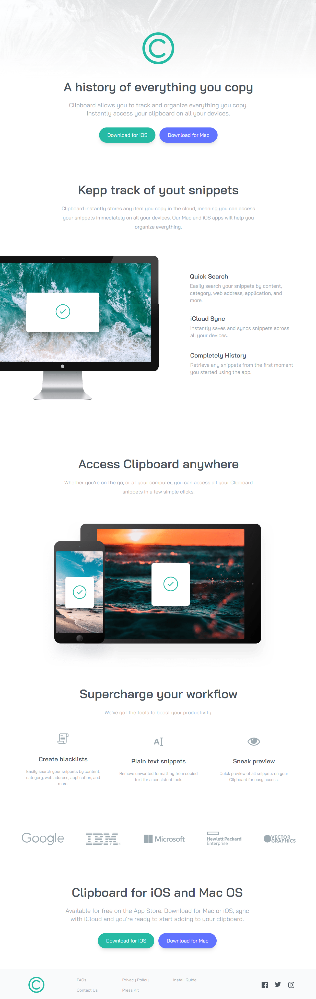

# Clipboard Website

Clipboard landing page from my Tailwind course (Tailwind CSS From Scratch | Learn By Building Projects
) and from [Frontend Mentor Challenge](https://www.frontendmentor.io/challenges/clipboard-landing-page-5cc9bccd6c4c91111378ecb9)

colors: strongCyan: "hsl(171, 66%, 44%)",
lightBlue: "hsl(233, 100%, 69%)",
darkGrayishBlue: "hsl(210, 10%, 33%)",
grayishBlue: "hsl(201, 11%, 66%)",

fontFamily: ["Bai Jamjuree", "sans-serif"]

On this website we have 7 sections and the footer:

HERO SECTION : Comprises of the Logo, content and download button

SNIPPETS SECTION :

FEATURES SECTION: Comprises of an Image and contents

ACCESS ANYWHERE SECTION :

SUPERCHARGE SECTION : A heading and 3 contents put in a flex-column on small screens and flex-row on medium screen and larger

REFERENCES SECTION : 5 reference images place in a flex

BOTTOM CTA SECTION : Content and download button

FOOTER : Comprises of the logo, some anchor tags and social icoms in svg format (given a hover style)

## Usage

Install dependencies

```
npm Install
```

Run Tailwind CLI

```
npm run watch
```


